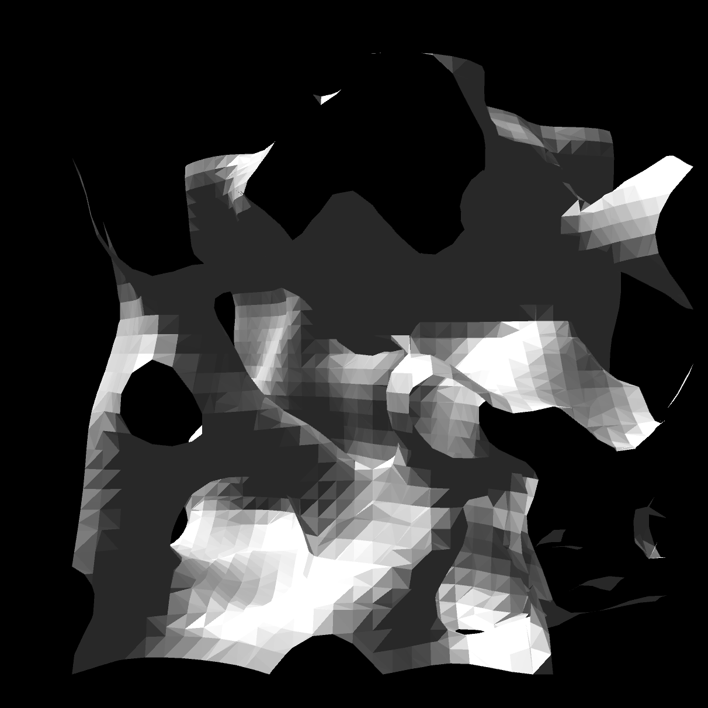
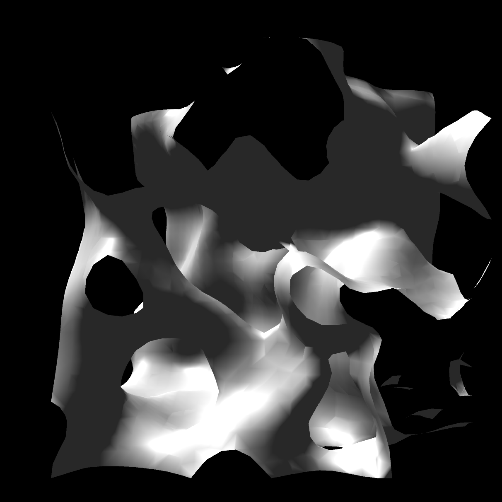

# Marching-Cubes

Using objects represented by a 3d array of data has become quite popular in games in the last few years. Voxel terrain is probable the most common application. Of course GPUs only understand triangles so the voxels have to be converted to a mesh some how.

 
The most common algorithm for doing this is called the marching cubes algorithm. Examples of code are very common on the internet. One of the best ones around in my opinion is this one [here](http://www.siafoo.net/snippet/100) and it is what I have based my code on. The thing I like about this code is that it also implements the marching tetrahedron algorithm that is a little more difficult to find good examples of. The marching tetrahedron algorithm produces a mesh that matches the voxel data much better than the cubes algorithm but produces far more vertices.

Update - Added the option to create smooth normals. 

